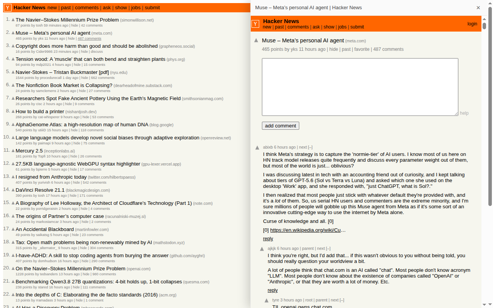
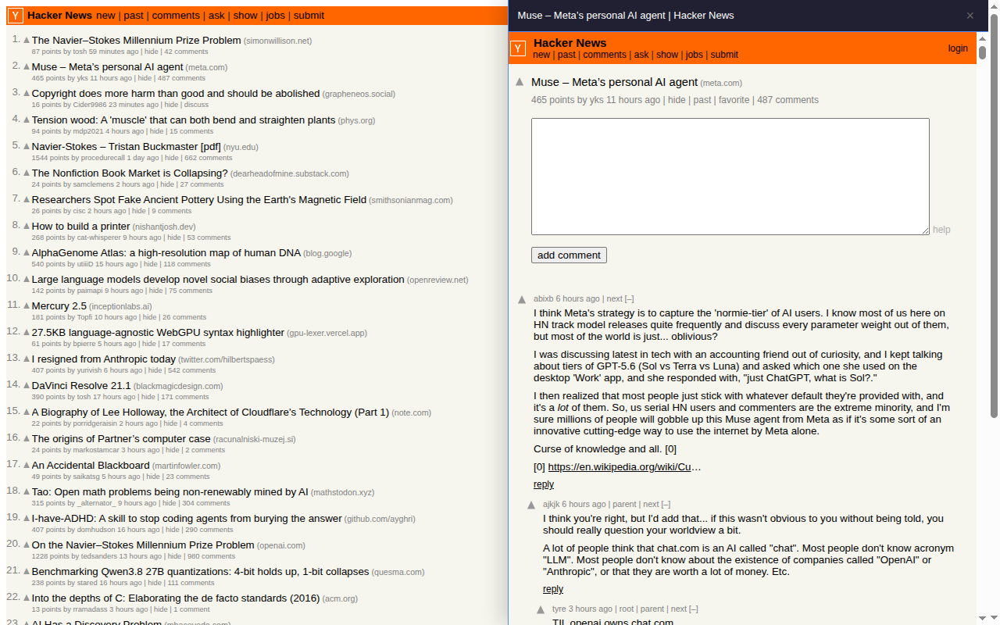

# ForumSplitReader

Browse forums like a mail client: **thread list on the left, preview on the right** —
no more back-and-forth navigation.

[中文 README](README_CN.md)

## Why

Reading forums like V2EX or Linux.do usually means a constant loop of
"list → open thread → back to list". It fragments attention, reloads pages,
and loses your scroll position. Thunderbird-style mail clients suggest a better
pattern: **keep the list, preview inline** — click a row to read it, click another
to swap.

We surveyed existing Chrome extensions; none fits exactly:

| Category | Examples | What's missing |
| --- | --- | --- |
| Hover preview | MaxFocus, Hover, etc. | A popup layer, not a real split view; links escape the popup |
| In-tab split | TabBoost, Split View, etc. | Manual commands; doesn't take over list link clicks |
| Forum-specific | V2EX Plus, etc. | Single-site only; often iframe-shell based |
| Open-anything sidebar | Page Sidebar, etc. | No list-page detection, no link rewriting |

ForumSplitReader fills the gap: **auto-activation + multi-forum + native tab
rendering** (not an iframe shell). On Hacker News, title links point to arbitrary
third-party sites whose iframe embedding is blocked by `X-Frame-Options`/`CSP`
in ways we can't enumerate — so titles open in a new tab while comments preview
in the sidebar (see Technical notes).

## Features

- **Sidebar preview**: click a thread on a list page; it opens in the right-hand
  panel. Click another to swap; click the same one to close.
- **List stays put**: the list remains on the left with its scroll position intact.
- **In-panel navigation**: same-site links inside the preview (pages, comments,
  user profiles) keep opening inside the panel.
- **Customizable appearance**: header background, title text color, and border
  color are adjustable in the options page, applied live.
- **Bilingual UI**: follows the browser language (English / 简体中文).

## Screenshots

**Hacker News** — comments open in the sidebar, the list stays put:



**Linux.do** — full thread rendering with site styling:


**Custom appearance** — header/title/border colors adjustable in options:



## Supported sites & click behavior

| Site | Click behavior |
| --- | --- |
| V2EX / Linux.do | Click a thread title → preview in sidebar |
| Hacker News | Click **comments** → preview in sidebar; click a **title** (third-party site) → new tab |
| All sites | Same-site links inside the panel stay in the panel; `Ctrl/Cmd/middle-click` keep native behavior |

## Install

**Chrome Web Store**: link to be added once published.

**Developer mode (local)**:

1. Clone this repository
2. Open `chrome://extensions` and enable "Developer mode"
3. Click "Load unpacked" and select the `src/` directory of this repo

> Note: Chrome 136+ stable removed the `--load-extension` command-line flag;
> developer-mode loading is unaffected.

## Customization

`chrome://extensions` → ForumSplitReader → "Extension options": adjust header
background, title text color, and border color. Changes apply live to open panels;
"Restore defaults" resets everything.

## Technical notes

Plain MV3: no build dependencies, no bundler, no background/service worker.

- **Architecture**: `content_scripts` (`document_start` + `all_frames`) plus an
  in-page iframe panel. The top-frame script intercepts list clicks; the preview
  frame's own script injects site-specific cleanup CSS and takes over in-panel
  navigation (same-site `location.assign` stays in-panel, everything else passes
  through). In-panel navigation never relies on same-origin parent access, so
  cross-origin concerns don't apply.
- **Adapter pattern**: one adapter per site (`content/sites/*.js`) implementing
  `matches / isListPage / findTopicAnchor / getTopicUrl / getTopicKey /
  shouldHandleUrl / getTopicAction / previewCss`. Adding a site is one file plus
  registration.
- **Why HN titles open in a tab** (measured across 14 commonly linked sites):
  github/wired send `DENY`, techcrunch/stackoverflow send `SAMEORIGIN`,
  theverge uses an allowlist, the rest allow embedding. The blocklist isn't
  enumerable, and stripping headers via declarativeNetRequest would require
  `<all_urls>`, affect all tabs globally, and still fail against frame-busting JS.
- **Hard-won lessons** (see git history for full investigations):
  - linux.do ships a global `iframe { max-height: min(1000px, 200vh) }` rule that
    clamps the preview panel (blank band below the panel grows with viewport
    height above ~1040px). Fixed with `max-height: none !important`.
  - Discourse's `#main-outlet-wrapper` is a two-column `grid-template-areas`
    layout; hiding the sidebar leaves the 273px track visually behind even with
    `!important` (Chrome returns used tracks for gridded areas). Fixed by
    switching the wrapper to `display: block`.
  - Preview CSS must be injected by the **frame's own** content script at
    `document_start` (`all_frames: true`) so it lands before first paint;
    otherwise sidebar/header flash briefly before disappearing.

## Development

Layout:

```
src/
├── manifest.json            # MV3 manifest (three-site content_scripts + options page + _locales)
├── options.html/.js         # Options page (panel appearance, i18n)
├── _locales/                # en / zh_CN messages
└── content/
    ├── index.js             # Entry: list-click routing + in-panel navigation + live settings
    ├── styles.css           # Panel styles (driven by --fsr-* variables)
    ├── core/                # config (storage) / dom (utils) / viewer (panel controller)
    └── sites/               # v2ex / linuxdo / hackernews adapters
scripts/build.sh             # Validate + package a store-ready zip
```

Build & verify:

```bash
scripts/build.sh          # -> dist/forum-split-reader-v<version>.zip (manifest at zip root)
scripts/build.sh --check  # Validate manifest and file integrity only
```

For automated testing: the DevTools Protocol's `Extensions.loadUnpacked` can
load/reload unpacked extensions in any browser started with
`--remote-debugging-port` — handy for CI or local verification.

## Permissions & privacy

- Permissions: `storage` only (appearance settings), plus content scripts on the
  three supported sites.
- No data collection, no network requests, no analytics; all settings stay in
  your local browser.

## License

[MIT](LICENSE)
