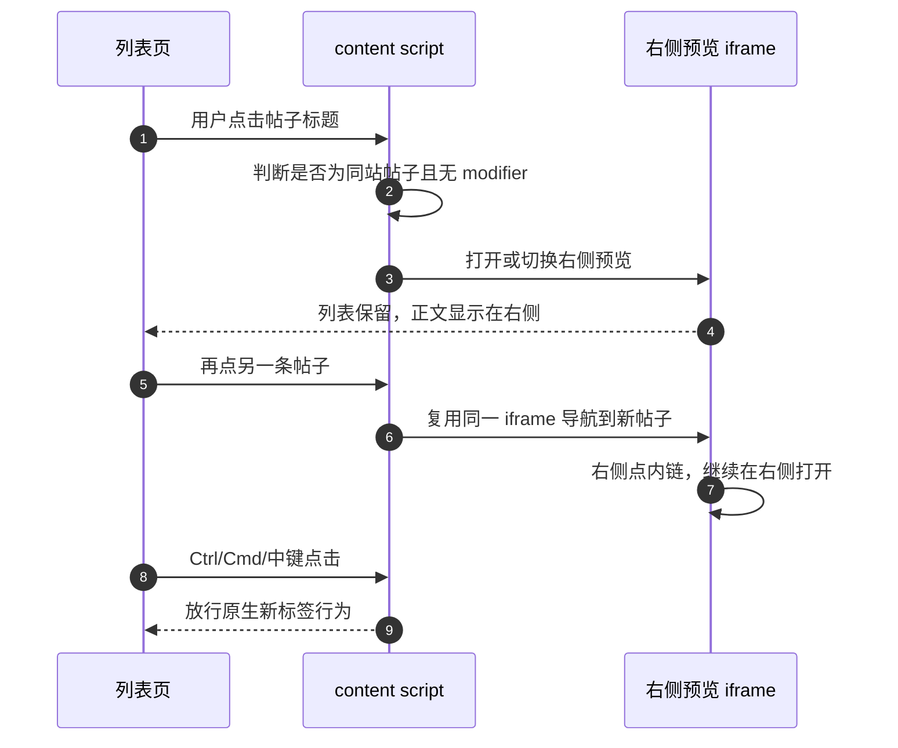
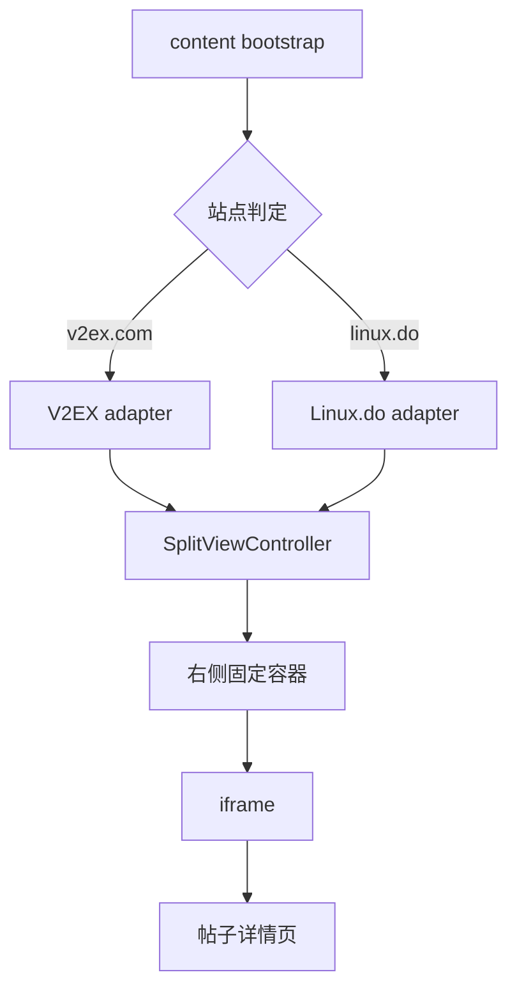

# Forum Helper — 详细设计

## 1. 目标

让 V2EX 与 Linux.do 的列表页具备邮件客户端式的双栏浏览：左侧保留话题列表，右侧就地预览帖子详情，切换帖子时不离开列表。

### 核心体验



### 非目标

- 不支持除 V2EX、Linux.do 外的站点。
- 不做通用论坛规则引擎。
- 不做 Side Panel 版本。
- 不做阅读模式、同步、回复增强。

## 2. 技术路线选择

### 候选路线

| 路线 | 优点 | 缺点 |
| ---- | ---- | ---- |
| Chrome Side Panel | 浏览器级持久面板 | API 控制弱；不适合承载论坛页的连续导航；实现复杂度高 |
| 新窗口 / 原生 Split View | 原生 tab 能力完整 | 只能摆布局，不能自动接管列表点击 |
| **站内分栏 + same-origin iframe** | 结构最直接；已被 `ref/v2ex-topic-viewer` 证明可行；适合双站定制 | iframe 方案上限受站点嵌入策略约束 |

### 结论

采用 **content script 注入的站内双栏 iframe 路线**。

原因：

1. `ref/v2ex-topic-viewer` 已经证明 V2EX 可以通过页面内插入 iframe 实现右侧预览。
2. 只支持 V2EX 与 Linux.do，两站定制比通用浏览器容器更省、更稳。
3. 真正的工程难点在站点 DOM 适配，不在 Chrome 面板 API。
4. MVP 可完全避免构建依赖，直接以 unpacked extension 加载。

## 3. 总体架构



### 模块职责

- `src/content/index.js`
  - 入口。
  - 根据 hostname 选择 adapter。
  - 初始化全局点击代理。

- `src/content/core/viewer.js`
  - 创建/销毁右侧固定容器。
  - 管理 iframe 生命周期。
  - 处理同一帖子点击关闭、不同帖子点击切换。
  - 给 iframe 内页面注入精简样式与链接行为。

- `src/content/core/config.js`
  - 默认设置。
  - 存储键名。

- `src/content/sites/v2ex.js`
  - V2EX 的列表页识别、帖子链接识别、详情页精简规则。

- `src/content/sites/linuxdo.js`
  - Linux.do 的列表页识别、帖子链接识别、详情页精简规则。

## 4. adapter 接口

每个站点导出统一接口：

```js
{
  id: 'v2ex' | 'linuxdo' | 'hackernews',
  matches(location): boolean,
  isListPage(document, location): boolean,
  findTopicAnchor(target): HTMLAnchorElement | null,
  getTopicUrl(anchor): string | null,
  getTopicKey(url): string,
  shouldHandleUrl(url): boolean,
  // 可选。决定列表页点击的链接走哪里：'panel'（侧栏预览，默认）、
  // 'tab'（新标签页打开，列表不动）、null（不拦截，放行原生行为）。
  // 未实现的 adapter 保持旧行为：shouldHandleUrl(url) 为真即 'panel'。
  getTopicAction(anchor, url): 'panel' | 'tab' | null,
  decoratePreviewDocument(doc): void
}
```

### 约束

- `findTopicAnchor` 只返回真正的帖子链接；用户页、节点页、设置页一律返回 `null`。
- `shouldHandleUrl` 只允许同站帖子 URL 留在右侧预览。
- `decoratePreviewDocument` 只能做减法：隐藏头部、侧栏、底栏、建议阅读等噪音，不得改正文结构。

## 5. 交互规则

### 左侧列表点击

拦截条件：

- 当前页面被 adapter 判断为列表页。
- 点击目标可追溯到帖子链接。
- 不是 `Ctrl/Cmd/Shift/Alt` 组合键。
- 不是中键点击。
- 不是 `target="_blank"` 且用户明确要新标签的场景。

处理行为：

- 首次点击：创建右侧容器 + iframe，并加载目标帖子。
- 点击另一帖子：复用同一 iframe 切换 URL。
- 再次点击同一帖子：关闭右侧预览。

### 右侧预览点击

- 同站帖子链接：仍在右侧打开。
- 外链、登录页、用户页、编辑页：升级为新标签。
- `Ctrl/Cmd/中键`：始终放行原生行为。

### Hacker News 分流（2026-09-08 决策）

HN 列表页有两类链接，行为不同：

- **comments 链接**（`subtext` 里的 `item?id=...`，含 Ask HN / Show HN
  指向 item 页的标题）：侧栏预览，与 V2EX/Linux.do 完全一致。
- **标题链接**（`span.titleline > a`，绝大多数是第三方站外 URL）：
  新标签页打开（`window.open(url, '_blank', 'noopener')`），列表页保持
  不动。不尝试侧栏加载第三方站。
- 其他小字链接（user、from、hide 等）：不拦截，原生行为。

依据（实测，见 §7 HN 小节）：第三方站 iframe 禁嵌策略不可穷举，侧栏方案
对这些链接不可靠；新标签页是唯一对所有站一致的行为。

## 6. 布局策略

### 页面层

右侧预览打开后：

- 给 `document.documentElement` 打标记类名，例如 `fh-preview-open`。
- 主页面收缩可视宽度，给右侧留出固定空间。
- 右侧容器固定定位：`right: 0; top: 0; height: 100vh; width: 48vw`。

### iframe 层

iframe 加载详情后，若可访问其 DOM，则注入站点专属样式。

#### V2EX

隐藏：

- 顶栏 `#Top`
- 底栏 `#Bottom`
- 右侧栏 `#Rightbar`

保留：

- 主内容 `#Main`
- 回复区

#### Linux.do（2026-09-08 两轮实测验证）

**第一轮修复**：`.more-topics__container` 类名 token 不匹配导致 450px 底部空白（`.more-topics` 选择器不匹配 `more-topics__container`）；强加 `#main-outlet max-width` 破坏响应式网格造成横向溢出。均已修。

**第二/三轮修复**（桌面宽度 iframe 复现 → 用户大屏 2560×1440 实测；690px 移动布局测试曾掩盖这些问题）：

1. **左侧空列**：`#main-outlet-wrapper` 是 grid 双列（`grid-template-areas: "sidebar content"`），sidebar 隐藏后 273px 轨道视觉留存。**`grid-template-columns: minmax(0,1fr)!important`（含 inline important）在 display:grid 下清不掉该轨道**——Chrome 对带 areas 的 grid 返回 areas 解析后的 used 轨道。最终修复：`#main-outlet-wrapper { display: block !important }` 直接绕开轨道系统（用户大屏实测 outletLeft 285→11、内容 918→1192 铺满 iframe）。`.btn-sidebar-toggle` 官方点击保留（onPreviewReady，状态持久化）。
2. **底部空白（Discourse 虚拟滚动）**：iframe 内只预渲染首屏附近楼层，首屏之下全部是 `.post-stream--cloaked` 空占位（实测 3700px+）。这是站点原生行为，不可关闭；处理为骨架条纹（9% 可见度），把"神秘空白"变成明确的加载占位。
3. **加载闪现**：预览样式改为由 iframe 自己的 content script 在 `document_start` 注入（manifest `all_frames: true`），早于首帧渲染；面板内导航拦截同由帧内 content script 接管，父页面不再做 same-origin 绑定。
4. **等效测试环境教训**：复刻 iframe 的 `contentDocument` 引用会因 Discourse 楼层路由（pushState 到 `/t/<id>/<楼层>`）与虚拟滚动而失效/错位，长帖滚动深测必须做 URL 前后校验与原子读数；测试视口必须覆盖用户真实大屏尺寸。
5. **预览面板底部固定空白（最终根因）**：linux.do 站点 CSS 有全局规则 `iframe { max-height: min(1000px, 200vh) }`，把预览 iframe 高度钳在 1000px——视口高 >1040px 时 `calc(100vh - 40px)` 被截断，iframe 下方留出随窗口高度增大的空白（小窗口测试永不触发，故多轮未现）。修复：`#fh-preview-frame { max-height: none !important }`。2026-09-08 在带真实扩展的浏览器中以 CDP 完整定位（含 vh 探针/对照实验/matched-rules 链）。

## 7. 站点识别

### V2EX

列表页判定：

- 页面上存在 `a.topic-link`
- 且数量达到最小阈值（如 ≥ 5）

帖子链接：

- `a.topic-link`

### Linux.do

列表页判定：

- 路径匹配 `/latest`、`/new`、`/top`、`/c/*`、`/tag/*` 等话题流页面
- 页面上存在 Discourse 话题链接选择器，如 `a.raw-topic-link` 或相近类名

帖子链接：

- 仅匹配话题标题链接
- 忽略分类、用户名、tag、导航链接

### Hacker News（2026-09-08 可行性实测后接入）

**列表页判定**：`span.titleline` ≥ 5（首页 /newest /front /show /ask /jobs 及分页）。

**两类链接分流**（`getTopicAction`）：

- `a[href^="item?id="]`（comments / discuss / AskHN / ShowHN 标题）→ `'panel'`
- `span.titleline > a` 的站外标题 → `'tab'`（新标签页打开）
- 其余（user、from、hide、morelink）→ `null`（不拦截）

**可行性依据**（2026-09-08，curl 抽查 14 站响应头 + 浏览器 iframe 实测）：

- HN 自身（首页与 item 页）**无 X-Frame-Options、无 CSP frame-ancestors**，
  item 讨论页可直接嵌入侧栏，cookie 同源，面板内 reply/user 等站内导航
  经帧内 content script 继续留在面板。
- 标题指向的第三方站禁嵌策略不可穷举：抽查中 github/wired 为
  `DENY`/`frame-ancestors 'none'`，techcrunch/stackoverflow 为
  `SAMEORIGIN`，theverge 为白名单，arstechnica/nytimes/medium/bbc/
  substack/youtube 无限制。
- **放弃 DNR（declarativeNetRequest）strip 方案**：需 `<all_urls>`
  host 权限（上架审核敏感）；strip 是全局副作用（该域在任何 tab 的
  iframe 都失去保护）；且对 frame-busting JS 与登录态交互（SameSite、
  第三方 cookie 拦截）无能为力。收益/代价比不支持，标题统一新标签页。

**面板内导航**：`shouldHandleUrl` 只放行 `news.ycombinator.com` 站内
URL（item/user/reply/threads），站外链接放行原生（iframe 内导航）。

**预览样式**：HN 为表格布局、无 XFO，天然 iframe 友好；previewCss
仅设原生背景色防白闪，不做结构裁剪。

## 8. 存储

设置存 `chrome.storage.local`（key：`forumHelperSettings`），读取方必须
与 `DEFAULT_SETTINGS` 合并兜底：

- `width: '48vw'`、`minWidth: '420px'`、`side: 'right'` — 面板尺寸
- `headerBg: '#fafafa'`、`titleColor: '#444444'`、`borderColor: '#ececec'`
  — 面板外观（options 页可改；颜色仅接受 `#rrggbb`，见
  `content/core/viewer.js` 的 `applyPanelColors`）

options 页保存后，`chrome.storage.onChanged` 让已打开面板的列表页
实时更新 CSS 变量，无需刷新页面。

## 9. 权限

`manifest.json`：

```json
{
  "manifest_version": 3,
  "name": "Forum Helper",
  "version": "0.1.0",
  "permissions": ["storage"],
  "options_page": "options.html",
  "content_scripts": [
    {
      "matches": [
        "*://*.v2ex.com/*",
        "*://linux.do/*",
        "*://news.ycombinator.com/*"
      ],
      "js": [
        "content/core/config.js",
        "content/core/dom.js",
        "content/core/viewer.js",
        "content/sites/v2ex.js",
        "content/sites/linuxdo.js",
        "content/sites/hackernews.js",
        "content/index.js"
      ],
      "css": ["content/styles.css"],
      "run_at": "document_start",
      "all_frames": true
    }
  ]
}
```

不引入 background、不引入 sidePanel、不引入额外 host 权限（仅三站）。
隐私：除上述设置外不读写任何数据，无网络请求、无分析。

## 9.5 构建与发布

```bash
scripts/build.sh          # 校验 manifest 与文件完整性，产出 dist/forum-helper-v<version>.zip
scripts/build.sh --check  # 仅校验
```

zip 根目录即 manifest.json，可直接上传 Chrome Web Store 开发者后台。
商店 checklist（上架前）：

- manifest `version` 递增
- 128px 图标 + 1280×800 截图（商店要求）
- 隐私说明（本扩展：仅本地设置存储）
- 开发者账号一次性注册费 $5

## 10. MVP 范围

### M1

- 扩展可作为 unpacked extension 加载。
- V2EX 列表页点击帖子，右侧出现预览。
- V2EX 再点同一帖子，关闭预览。
- 右侧预览内同站帖子继续在右侧打开。
- Linux.do adapter 代码落位并具备保守识别结构。

### M2

- Linux.do 列表页稳定支持。
- 宽度设置。
- 开关设置。

### M3

- 已读标记。
- 键盘导航。
- 外链策略细化。

## 11. 风险与回退

| 风险 | 说明 | 回退 |
| ---- | ---- | ---- |
| 站点禁止 iframe | 若某页发送拒绝嵌入策略，右侧无法显示 | 该类 URL 直接升级为新标签 |
| Linux.do DOM 频繁变化 | Discourse 主题类名、布局可能变 | adapter 只写保守规则，必要时增补 MutationObserver |
| 右侧页面可交互但视觉拥挤 | 回复框、时间线、浮层占空间 | 通过 `decoratePreviewDocument` 追加隐藏规则 |
| 主页面被压缩后布局变形 | 原站点本身响应式在窄宽下变化 | 默认宽度保守设为 48vw，并保留后续设置项 |

## 12. 验证策略

代码级验证：

- `node --check` 覆盖全部 JS 文件。
- 用 Python 解析 `src/manifest.json` 验证 JSON 合法。

人工浏览器验证：

1. Chrome 加载 unpacked extension。
2. 打开 V2EX 首页或节点列表。
3. 连续点击 5 个不同帖子，确认都在右侧预览。
4. 再点当前帖子，确认预览关闭。
5. 右侧点一个同站帖子链接，确认仍在右侧打开。
6. `Ctrl/Cmd + Click` 一个标题，确认走新标签。
7. 打开 Linux.do 的 latest 页面，确认不会错误拦截非帖子链接。

## 13. 当前结论

本项目的正确起点不是做一个通用浏览器面板，而是做一个**双站定制的论坛列表页增强插件**。`ref/v2ex-topic-viewer` 证明了路线成立；我们的工作是把它工程化、模块化，并补上 Linux.do 适配与后续设置能力。